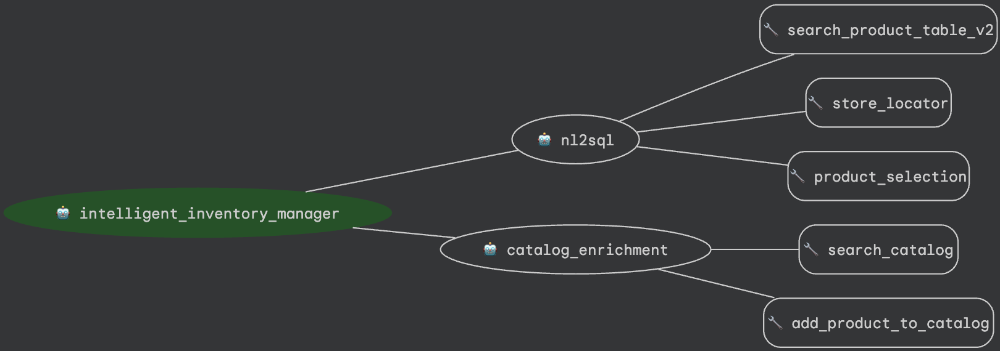

# Intelligent Inventory Manager Agent

The **Intelligent Inventory Manager** is an AI-powered orchestrator designed for retailers. It serves as a unified conversational interface to manage inventory, query for specific product SKUs across store locations, and enrich the online catalog with AI-generated content.

## Architecture & Sub-Agents

This agent employs a hierarchical design. The central `intelligent_inventory_manager` agent routes user requests to specialized sub-agents based on the task:



1.  **`nl2sql_agent` (Retail Concierge)**
    *   **Purpose**: Handles product discovery and inventory lookup.
    *   **Capabilities**: Allows users to search the current catalog, filter by specific attributes (like price), and check availability at nearby retail store locations.
    *   **Tools**:
        *   `search_product_table` / `search_product_table_v2`: Queries the BigQuery catalog for items using natural language searches and price filters.
        *   `store_locator`: Checks inventory levels for specific SKUs across physical stores.
        *   `product_selection`: Aids the user in narrowing down their search results.

2.  **`catalog_enrichment_agent` (Catalog specialist)**
    *   **Purpose**: Streamlines the process of adding new products to the system.
    *   **Capabilities**: Takes basic product information from the user (name, brand, price), uses AI to generate compelling product descriptions and categorizations, and stages the enriched product for review.
    *   **Tools**:
        *   `search_catalog`: Queries BigQuery to verify if a product already exists before adding it.
        *   `add_product_to_catalog`: Stages the newly enriched SKU details for review before insertion into the `cymbal_retail.product_catalog` BigQuery table.

## Services & Integration

*   **Google Gemini**: The agent orchestrator and its sub-agents are powered by `gemini-2.5-flash`, utilizing Google's Agent Development Kit (ADK).
*   **Google Cloud BigQuery**: Used as the primary retail catalog and inventory database. The agents use custom Python tools to query BQ directly (`nl2sql_agent`) and use BQML for semantic similarity searches.

## How to Use

1.  **Launch the Agent**: You can run the agent locally through the ADK CLI:
    ```bash
    adk run intelligent_inventory_manager/
    ```
2.  **Interacting**: Talk to the agent naturally! 
    *   *To search*: "Find me some red cups under $10."
    *   *To check inventory*: "Do you have any of those cups available in the San Francisco store?"
    *   *To add items*: "I need to add a new product. It's a Blue Yeti Microphone, brand is Logitech, and it costs $120."
